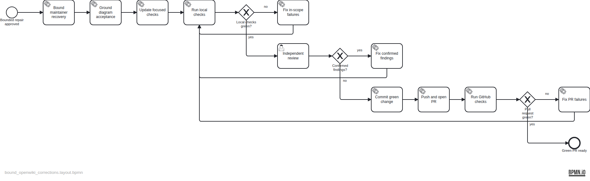

TASK-21 plan for replacing OpenWiki's unbounded whole-generation correction loop with proportional diagram-bundle rejection and a one-retry ceiling. Internal generator semantic authorship, single-writer locking, and reset-on-new-main behavior remain unchanged.

The deterministic source specification is `assets/doc-30/plan-spec.json`; the semantic BPMN is `assets/doc-30/plan.bpmn`.
