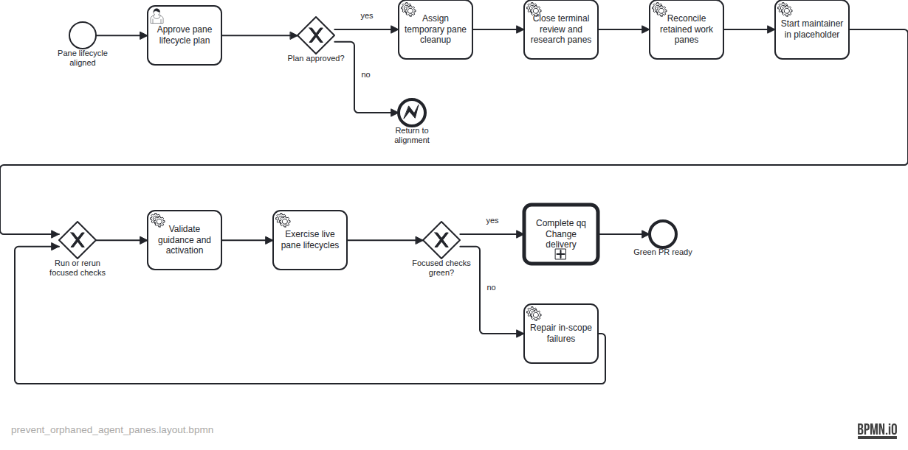

# Plan — Prevent orphaned agent panes

TASK-25 assigns temporary delegate-pane cleanup to the spawning agent and makes OpenWiki launch its maintainer inside the worktree placeholder. Review and research close terminal delegates; accountable and operator-created panes remain intact.

The evidence-stamped specification is at `backlog/docs/plans/assets/doc-34/plan-spec.json`; the semantic BPMN is at `backlog/docs/plans/assets/doc-34/plan.bpmn`.

---

# BPMN conformance report

Plan: /home/qqp/.herdr/worktrees/qq/fix-delegate-pane-cleanup/backlog/docs/plans/assets/doc-34/plan.bpmn

## Summary

- Flow nodes: 15
- Accounted: 15
- Unaccounted: 0
- Diverged: 0
- Unknown completion IDs: 0
- Strict verdict: PASS

## Per-element status

| ID | Name | Type | Status | Evidence / note |
| --- | --- | --- | --- | --- |
| start | Pane lifecycle aligned | StartEvent | done | Evidence: TASK-25 and doc-34 record the aligned temporary-pane and OpenWiki placeholder outcome. |
| approve_plan | Approve pane lifecycle plan | UserTask | done | Evidence: The operator approved the rendered plan and its placeholder-reuse revision before implementation. |
| plan_approved | Plan approved? | ExclusiveGateway | done | Evidence: Operator approval selected the yes branch. |
| return_alignment | Return to alignment | EndEvent | skipped | Note: The operator approved the plan, so the rejection branch was not taken. |
| assign_cleanup_owner | Assign temporary pane cleanup | ServiceTask | done | Evidence: skills/agent-messaging/SKILL.md assigns each temporary delegate pane to the spawning agent through verified teardown. |
| close_terminal_delegates | Close terminal review and research panes | ServiceTask | done | Evidence: skills/code-review/SKILL.md and skills/research/SKILL.md close and verify terminal delegate panes after required follow-up. |
| reconcile_retention | Reconcile retained work panes | ServiceTask | done | Evidence: skills/deliver-change/SKILL.md and cockpit/README.md retain accountable and operator-created panes, not completed delegates. |
| reuse_openwiki_placeholder | Start maintainer in placeholder | ServiceTask | done | Evidence: bin/qq-openwiki-activate verifies the sole root pane is idle, starts Codex there, detects it, and assigns its stable maintainer name without agent start. |
| checks_entry | Run or rerun focused checks | ExclusiveGateway | done | Evidence: Initial, review-repair, plan-regeneration, and final verification paths re-entered the focused checks. |
| validate_guidance | Validate guidance and activation | ServiceTask | done | Evidence: All repository shell harnesses, 18 BPMN tests, four changed-Skill validators, Python compile, shell syntax, ShellCheck, plan lint, lossless round trip, and diff hygiene passed. |
| exercise_cleanup | Exercise live pane lifecycles | ServiceTask | done | Evidence: Disposable workspace w2N started Codex in its single root pane and was removed; reviewer panes w2G:p3 and w2G:p4 were closed and stopped resolving, leaving only accountable pane w2G:p2. The known w2E workspace retired externally before guarded cleanup, so no maintainer pane was touched. |
| checks_green | Focused checks green? | ExclusiveGateway | done | Evidence: Fresh affected and full checks passed after every repair; the green branch was taken. |
| repair | Repair in-scope failures | ServiceTask | done | Evidence: Independent review exposed busy-placeholder and optional-session detection gaps, then a low Task-index gap; each received the smallest in-scope fix, rerun checks, and a clean exact-delta review. |
| complete_delivery | Complete qq Change delivery | CallActivity | done | Evidence: Independent review closed with no material findings after exact-delta re-review; commit d210558 was pushed and PR #67 is open, mergeable, CLEAN, and has no configured GitHub checks. Note: Conformance recording and TASK-25 finalization are closeout metadata outside BPMN flow nodes and follow this report in the same PR. |
| green_pr | Green PR ready | EndEvent | done | Evidence: GitHub PR #67 is the reviewed green one-PR handoff surface for TASK-25. |

## Unaccounted elements

None.

## Unknown completion IDs

None.

## Divergence summary

No elements diverged.
